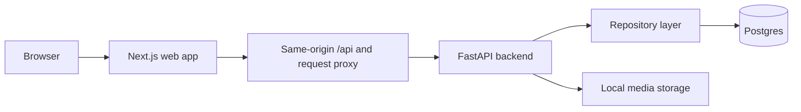

# Platform Architecture

This directory captures the engineering shape of the current platform as it
exists today. It is meant for onboarding, maintenance, and architectural
decision context rather than feature marketing.

## Document Map

- `request-lifecycle.md`: end-to-end request flow across the web and API apps
- `frontend-backend-coordination.md`: same-origin proxying, typed API access,
  and dashboard coordination patterns
- `frontend-architecture.md`: public app structure, route ownership, UI system
  boundaries, and content rendering patterns
- `auth-architecture.md`: admin session lifecycle and authorization boundaries
- `cms-architecture.md`: content, publishing, locale, media, and persistence
  workflows
- `ai-rag-architecture.md`: ingestion, retrieval, prompting, and assistant
  delivery for the engineering portfolio guide
- `deployment-architecture.md`: deployment shape across Vercel, FastAPI,
  PostgreSQL, Docker, and production caveats
- `engineering-philosophy.md`: practical engineering principles that shape the
  platform's implementation choices
- `onboarding.md`: subsystem overview and where engineering responsibilities live
- `current-limitations.md`: current scope boundaries and intentionally deferred complexity
- `why-not-x.md`: concise engineering rationale for notable architectural choices
- `adrs/`: concise architecture decision records for the current platform shape

## Current System Shape

The monorepo is intentionally split into a web application, an API application,
shared packages, and infrastructure support directories.

- `apps/web` owns the user experience, dashboard UI, same-origin API routes,
  locale routing, and server-rendered integration with backend contracts.
- `apps/api` owns typed backend contracts, request validation, admin auth,
  content persistence, and local media serving.
- `packages/*` reserve space for shared configuration and utilities without
  forcing the applications into one deployment unit.

## Architectural Intent

The platform is being evolved as a real product foundation rather than a static
portfolio site. That shows up in a few deliberate choices:

- A monorepo keeps frontend and backend contracts close while letting each app
  evolve independently.
- FastAPI provides typed HTTP boundaries and async request handling without
  adding unnecessary framework ceremony.
- SQLAlchemy async repositories provide one persistence seam for content,
  publishing, and future indexing workflows.
- Same-origin Next.js proxy routes keep browser auth and backend integration
  simple while preserving room for stricter gateway behavior later.

## Runtime Overview

The runtime intentionally stays compact. Web concerns, backend concerns,
persistence, and media handling are separated, but the system does not pretend
to be more distributed than it is.

## Current AI / Retrieval Posture

The platform now includes a working manual RAG pipeline:

- content items carry `ai_indexable` and `indexed_at` metadata
- markdown architecture docs and CMS content are ingested into pgvector
- retrieval and assistant APIs are implemented as stable backend boundaries
- prompt construction is grounded in retrieved content rather than generic chat

What remains intentionally small is the operational shape around that system:
manual ingestion, no background indexing workers, and no heavier agent layer.

## Reading Order

1. Start with `onboarding.md` for subsystem ownership and runtime orientation.
2. Read `request-lifecycle.md` to understand actual request coordination.
3. Read `auth-architecture.md` and `cms-architecture.md` for the operational
  flows behind the dashboard and publishing system.
4. Read `frontend-architecture.md` and `ai-rag-architecture.md` for the public
  experience and retrieval system.
5. Use `adrs/` when you need the reasoning behind a structural choice.