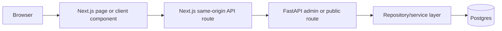
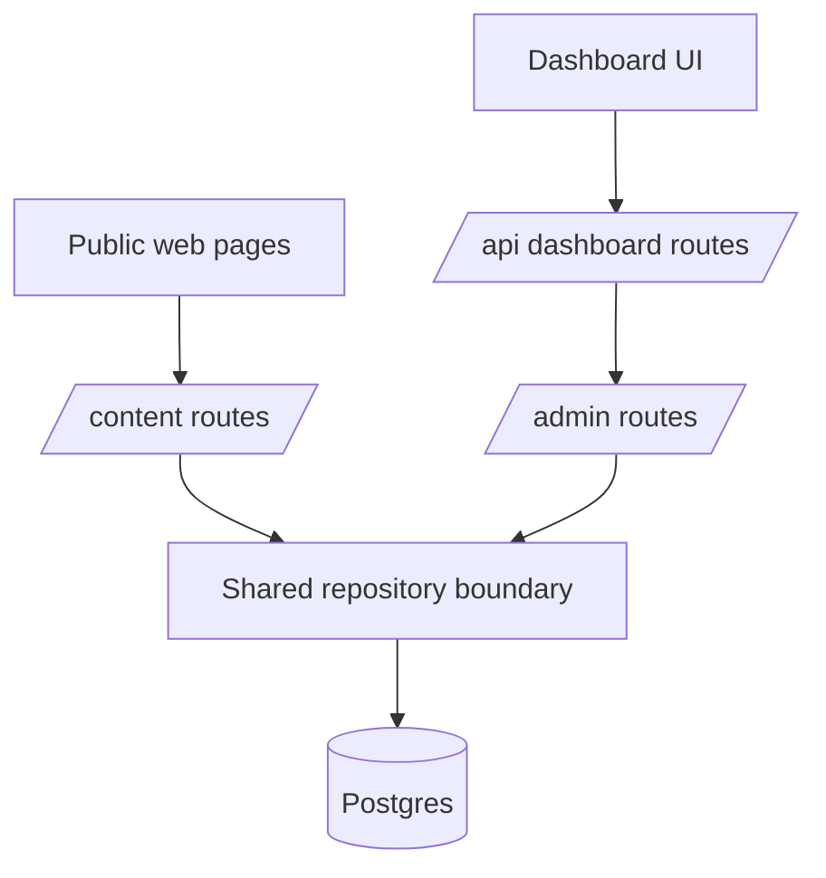

# Frontend and Backend Coordination

This platform uses a deliberate split between user-facing web concerns and
backend system concerns.

## Coordination Diagram

## Why the Monorepo Is Structured This Way

The repository keeps `apps/web` and `apps/api` together because the most
important coupling in the current system is contract-level coupling.

- frontend pages and dashboard screens need stable backend response shapes
- backend APIs need to evolve without forcing the browser to know deployment
  topology details
- shared packages can emerge naturally without prematurely collapsing the two
  apps into one runtime

This arrangement supports product iteration while keeping ownership boundaries
clear.

## Same-Origin Proxy Architecture

The browser does not call authenticated backend admin routes directly.

- browser code calls same-origin Next.js routes under `/api`
- route handlers proxy those requests to FastAPI
- the proxy attaches the dashboard token from an HttpOnly cookie
- the backend still performs all session validation and authorization

The result is a lightweight backend-for-frontend pattern.

Benefits of the current approach:

- browser code stays independent from backend hostnames
- session forwarding is centralized in one layer
- future audit logging, rate limiting, or request shaping can be added without
  rewriting client components
- the dashboard can remain same-origin even if the API deployment topology
  changes later

## Admin and Public API Separation

## Typed Request Coordination

The coordination path is intentionally layered.

- endpoint wrappers in `apps/web/src/lib/api/endpoints/*` understand route
  shapes and return types
- `apps/web/src/lib/api/http-client.ts` owns transport behavior such as timeout,
  bearer token injection, and error normalization
- `apps/api/app/schemas/*` define backend request and response contracts
- repositories and services remain hidden behind route handlers

This keeps UI code focused on product behavior rather than transport concerns.

## Locale-Aware Coordination

Locale behavior is split between web routing and backend filtering.

- the web app decides which locale a request should resolve to
- the backend treats locale as a first-class query and persistence field
- public reads always combine locale and publish state
- admin reads can filter by locale without changing route structure

That separation keeps localized URL behavior out of backend routing while still
making localized content retrieval explicit and queryable.

## Dashboard Workflow Shape

The dashboard is structured around operational surfaces rather than page-local
data fetching.

- `content-workspace.tsx` coordinates list, overview, filters, and destructive
  actions for persisted content
- editor routes create and update content via the same BFF layer
- media management uses the same auth-forwarding pattern as content operations
- session resolution is available to server components through
  `lib/auth/session.ts`

This gives the dashboard a stable interaction model even as the backend grows.

## Why Not Direct Browser-to-Backend Access?

Direct browser calls would couple client code to backend topology and shift more
auth handling into the browser surface. The current same-origin BFF pattern is
chosen for transport simplicity and maintainable session coordination.