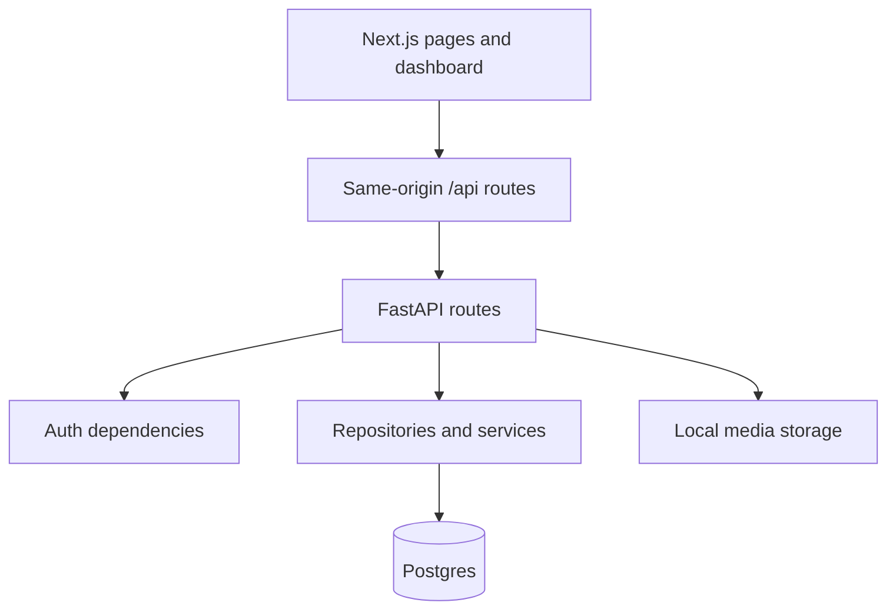

# Engineering Onboarding

This document is the fastest path to understanding how the platform works.

## What the Platform Is

The repository contains a web application, an API application, and a small set
of shared package spaces. The current system is a real product foundation for a
content-driven engineering platform, not a static marketing site.

Core capabilities that already exist:

- public content delivery
- authenticated dashboard access
- content CRUD and publishing states
- locale-aware routing and content filtering
- local media upload and serving
- typed backend contracts and persisted content

## Subsystem Overview

### Web application

`apps/web` owns:

- Next.js App Router pages
- dashboard UI surfaces
- locale-aware routing and path normalization
- same-origin auth and BFF routes under `/api`
- typed frontend endpoint wrappers

### API application

`apps/api` owns:

- FastAPI request handling
- admin authentication
- public and admin API separation
- SQLAlchemy async persistence
- repository-layer query and mutation behavior
- static serving for uploaded media

### Persistence layer

The backend persists:

- admin users for dashboard identity
- content items for editorial and public content delivery

The content model is shared across multiple collections through a type field and
common publishing semantics.

## Where To Start Reading

1. `apps/web/src/proxy.ts` for request coordination and locale/auth gating.
2. `apps/web/src/lib/api/route-utils.ts` for the same-origin proxy boundary.
3. `apps/api/app/main.py` for backend composition.
4. `apps/api/app/api/router.py` for exposed backend surfaces.
5. `apps/api/app/db/repositories/content_repository.py` for content lifecycle rules.
6. `docs/architecture/request-lifecycle.md` for end-to-end flow.

## Runtime Relationships

## Responsibility Rules

- If the concern is browser routing, locale redirects, or dashboard UI, start in
  `apps/web`.
- If the concern is request validation, auth enforcement, or API response shape,
  start in `apps/api/app/api`.
- If the concern is query semantics, slug handling, publish-state behavior, or
  commit lifecycle, start in `apps/api/app/db/repositories`.
- If the concern is high-level product capabilities or architecture reasoning,
  start in `docs/architecture`.

## Operational Boundaries

- public content reads are separate from admin mutations
- the web app owns cookie issuance and same-origin proxy behavior
- the backend owns session validity and persistence rules
- local media is intentionally handled without a separate asset platform

## Current Scope

This platform already has real persistence and operational editorial workflows,
but it intentionally does not yet include:

- distributed session control
- background job workers
- cloud object storage
- vector retrieval infrastructure
- automated ingestion or indexing pipelines

Those boundaries are part of the current sequencing, not missing explanation.