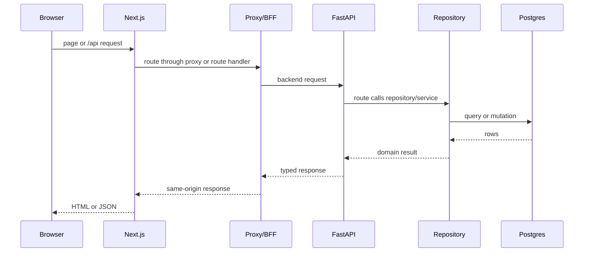
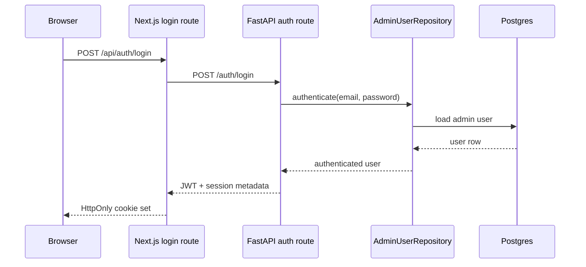
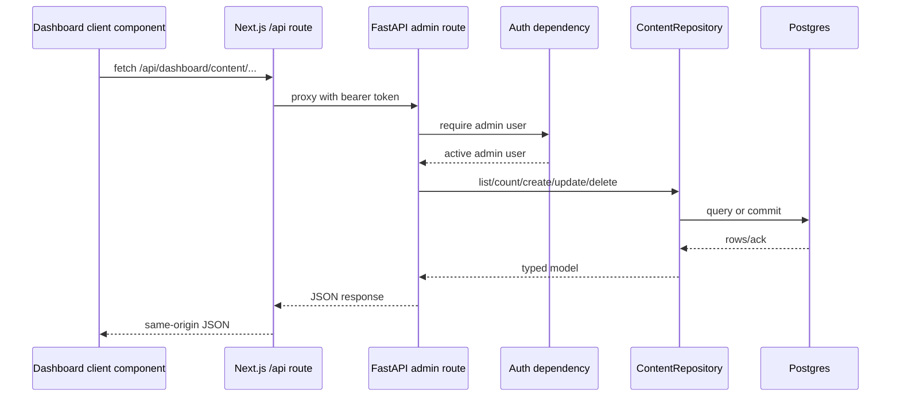

# Request Lifecycle

This document explains how requests move through the current platform.

## System Request Map

## 1. Public Web Request

For a standard page request, the browser hits the Next.js app first.

1. `apps/web/src/proxy.ts` runs before routing and normalizes locale behavior.
2. Default-locale traffic stays unprefixed; non-default locale paths are
   rewritten back onto the shared route tree.
3. Page code calls typed endpoint wrappers such as
   `apps/web/src/lib/api/endpoints/content-api.ts`.
4. Those wrappers use `apps/web/src/lib/api/http-client.ts` to reach the
   backend.
5. The backend public content routes in `apps/api/app/api/routes/content.py`
   query the repository with `status="published"` and the requested locale.
6. `apps/api/app/db/repositories/content_repository.py` applies filtering,
   ordering, and slug matching against the shared content model.

The key separation is that locale routing is handled in the web app, while
publish-state enforcement is handled in the backend.

### Ownership

- Next.js owns locale-aware routing and page composition.
- FastAPI owns public content eligibility.
- The repository owns query semantics and slug lookup behavior.

## 2. Dashboard Session Request

Dashboard traffic adds a same-origin session loop.

1. The browser submits credentials to `apps/web/src/app/api/auth/login/route.ts`.
2. That route forwards the payload to `POST /auth/login` on the backend.
3. `apps/api/app/api/routes/auth.py` authenticates via
   `AdminUserRepository`, then returns a signed JWT and session metadata.
4. The Next.js login route stores the JWT in the `dashboard_access_token`
   HttpOnly cookie.
5. Later dashboard page requests pass through `apps/web/src/proxy.ts`, which
   redirects unauthenticated users away from `/dashboard`.
6. Server components call `apps/web/src/lib/auth/session.ts`, which validates
   the cookie against `GET /auth/session` before treating the request as an
   active admin session.

The cookie only proves that a browser holds a token. The backend remains the
authority on whether that token is valid and maps to an active user.

## Session Diagram

## 3. Dashboard Data Request

Interactive dashboard UI talks to same-origin Next.js API routes instead of the
backend directly.

1. Client components such as
   `apps/web/src/components/dashboard/content-workspace.tsx` call
   `/api/dashboard/...` routes.
2. Route handlers in `apps/web/src/app/api/dashboard/**` use
   `apps/web/src/lib/api/route-utils.ts`.
3. Route utilities read the dashboard token from the HttpOnly cookie and attach
   it as a bearer token to the backend request.
4. Backend admin routes enforce auth through
   `apps/api/app/api/dependencies/auth.py`.
5. Repositories execute the actual content or media operation and return typed
   responses.

This BFF pattern keeps browser code same-origin and centralizes token
forwarding, backend URL resolution, and future gateway behavior.

## Dashboard Data Diagram

### Request Ownership

- Client components own UI state and timing.
- Next.js BFF routes own same-origin transport and token forwarding.
- FastAPI routes own request validation and response shape.
- Repositories own persistence rules.

## 4. Media Upload Request

The media workflow follows the same authenticated path with multipart payloads.

1. The dashboard uploads a `FormData` payload to `/api/dashboard/media`.
2. The Next.js media route proxies the multipart request to `POST /admin/media`.
3. `apps/api/app/api/routes/admin/media.py` validates auth and delegates to
   `LocalMediaStorage`.
4. `apps/api/app/services/media_storage.py` validates image content types,
   writes files under the configured local storage path, and returns public URL
   metadata.
5. `apps/api/app/main.py` serves the resulting files through FastAPI static
   file mounting at `/media`.

This is intentionally simple and local. The route/service split preserves a
clear migration seam if object storage is introduced later.

## Persistence Lifecycle

For content and auth-backed operations, persistence follows the same pattern.

1. FastAPI receives a validated request with a request-scoped AsyncSession.
2. The route calls a repository or service.
3. Query logic, slug normalization, and publish-state handling happen inside
    the persistence boundary.
4. Mutations commit within the repository.
5. The route serializes the resulting model through Pydantic response schemas.

## Current Scope Boundaries

- No background workers participate in request completion.
- No distributed session invalidation exists beyond token expiry and user state.
- No async ingestion or indexing pipeline is triggered by content writes.
- Search and assistant routes remain contract boundaries rather than deep
   retrieval systems.